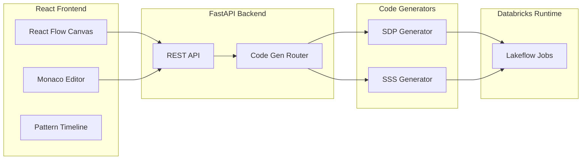

# LakeStream CEP Builder

**Visual Complex Event Processing for Databricks**

[](https://github.com/sourabhghose/lakestream-cep-builder/actions/workflows/ci.yml)
[](https://github.com/sourabhghose/lakestream-cep-builder/actions/workflows/deploy.yml)
[]()
[]()
[]()

---

## Overview

LakeStream CEP Builder is a visual pipeline builder for designing Complex Event Processing (CEP) workflows on Databricks. It provides a drag-and-drop canvas where you compose streaming pipelines from 38 node types—sources, CEP patterns, transforms, and sinks—and generates production-ready code for either **Lakeflow Declarative Pipelines (SDP)** or **Spark Structured Streaming** with one-click deploy to Databricks Lakeflow Jobs.

The tool bridges the gap between visual design and code: you design pipelines graphically, configure nodes via forms, and the backend generates Databricks notebooks and SQL that run natively on Lakeflow. CEP patterns are inspired by Flink CEP, Esper, and Siddhi, and leverage Spark 4.0's TransformWithState for stateful pattern matching when targeting SSS.

---

## Architecture



---

## Key Features

- **38 drag-and-drop node types**: 8 sources, 12 CEP patterns, 10 transforms, 8 sinks
- **Dual code generation**: Lakeflow Declarative Pipelines (SDP) + Spark Structured Streaming
- **12 CEP pattern nodes** inspired by Flink CEP, Esper, and Siddhi
- **TransformWithState** (Spark 4.0) for stateful pattern matching
- **Monaco code editor** with bidirectional sync
- **Pattern timeline visualization**
- **10 pre-built use case templates**
- **One-click deploy** to Databricks Lakeflow Jobs
- **Unity Catalog integration** for pipeline metadata

---

## Node Library

| Category | Node | Code Target |
|----------|------|-------------|
| **Sources (8)** | Kafka Topic | sdp-or-sss |
| | Delta Table Source | sdp-or-sss |
| | Auto Loader | sdp-or-sss |
| | REST/Webhook Source | sdp-or-sss |
| | CDC Stream | sdp-or-sss |
| | Event Hub / Kinesis | sdp-or-sss |
| | MQTT | sdp-or-sss |
| | Custom Python Source | sss |
| **CEP Patterns (12)** | Sequence Detector | sdp-or-sss |
| | Absence Detector | sdp-or-sss |
| | Count Threshold | sdp-or-sss |
| | Velocity Detector | sdp-or-sss |
| | Geofence / Location | sdp-or-sss |
| | Temporal Correlation | sdp-or-sss |
| | Trend Detector | sdp-or-sss |
| | Outlier / Anomaly | sdp-or-sss |
| | Session Detector | sdp-or-sss |
| | Deduplication | sdp-or-sss |
| | MATCH_RECOGNIZE SQL | sdp |
| | Custom StatefulProcessor | sss |
| **Transforms (10)** | Filter | sdp-or-sss |
| | Map / Select | sdp-or-sss |
| | Flatten / Explode | sdp-or-sss |
| | Lookup Enrichment | sdp-or-sss |
| | Window Aggregate | sdp-or-sss |
| | Stream-Stream Join | sdp-or-sss |
| | Stream-Static Join | sdp-or-sss |
| | Union / Merge | sdp-or-sss |
| | Rename / Cast | sdp-or-sss |
| | Custom Python UDF | sss |
| **Sinks (8)** | Delta Table Sink | sdp-or-sss |
| | Kafka Topic Sink | sdp-or-sss |
| | REST/Webhook Sink | sdp-or-sss |
| | Slack / Teams / PagerDuty | sdp-or-sss |
| | Email Sink | sdp-or-sss |
| | SQL Warehouse Sink | sdp-or-sss |
| | Unity Catalog Table Sink | sdp-or-sss |
| | Dead Letter Queue | sdp-or-sss |

---

## Tech Stack

| Layer | Technologies |
|-------|--------------|
| **Frontend** | Next.js 14, React Flow v12, Monaco Editor, Zustand, shadcn/ui, Tailwind CSS |
| **Backend** | FastAPI, Jinja2, Databricks SDK, Pydantic v2 |
| **Runtime** | Lakeflow Declarative Pipelines (SDP), Spark Structured Streaming + TransformWithState |

---

## Quick Start

### Prerequisites

- **Node.js** 20+
- **Python** 3.10+
- **Databricks workspace** with Lakeflow enabled

### Frontend Setup

```bash
cd frontend
npm install
npm run dev
```

Frontend runs at http://localhost:3000

### Backend Setup

```bash
cd backend
pip install -r requirements.txt
uvicorn app.main:app --reload
```

Backend runs at http://localhost:8000

### Environment Variables

Copy `.env.example` to `.env` and configure:

```bash
cp .env.example .env
```

---

## Project Structure

```
lakestream-cep-builder/
├── frontend/                 # Next.js React app
│   ├── src/
│   │   ├── components/       # Canvas, nodes, panels, editors
│   │   ├── lib/              # nodeRegistry, stores
│   │   └── types/           # Node types, pipeline models
│   └── package.json
├── backend/                  # FastAPI app
│   ├── app/
│   │   ├── api/             # REST routes (pipelines, codegen, deploy)
│   │   ├── codegen/         # SDP and SSS generators
│   │   ├── models/          # Pydantic models
│   │   └── main.py
│   ├── templates/           # Jinja2 templates (sdp/, sss/)
│   └── requirements.txt
├── docs/
│   └── ARCHITECTURE.md
├── databricks.yml           # Databricks Asset Bundle config
├── app.yml                  # Databricks App config
├── docker-compose.yml
├── Makefile
└── README.md
```

---

## Development

| Command | Description |
|---------|-------------|
| `make install` | Install frontend and backend dependencies |
| `make dev-frontend` | Run Next.js dev server |
| `make dev-backend` | Run FastAPI with reload |
| `make dev` | Run both frontend and backend |
| `make lint` | Run linting |
| `make test` | Run tests |
| `make build` | Build frontend for production |
| `make clean` | Remove build artifacts |

---

## CEP Patterns

| Pattern | Description |
|---------|-------------|
| **Sequence Detector** | Detect ordered sequences of events (A to B to C) with contiguity modes |
| **Absence Detector** | Detect when expected events are missing within a time window |
| **Count Threshold** | Trigger when event count exceeds threshold in a window |
| **Velocity Detector** | Detect rate anomalies (events per second/minute/hour) |
| **Geofence / Location** | Spatial event detection (enter/exit/dwell) for lat/lon |
| **Temporal Correlation** | Correlate events from two streams by time and key |
| **Trend Detector** | Detect upward/downward trends in numeric values |
| **Outlier / Anomaly** | Statistical anomaly detection (Z-score, IQR, MAD) |
| **Session Detector** | Group events into sessions by gap duration |
| **Deduplication** | Remove duplicate events by key with watermark |
| **MATCH_RECOGNIZE SQL** | SQL-based pattern matching (partition, order, measures, pattern) |
| **Custom StatefulProcessor** | Custom stateful processing in Python (TransformWithState) |

---

## Templates

| Template | Use Case |
|----------|----------|
| Fraud Detection | Login velocity, sequence anomalies, threshold alerts |
| IoT Sensor Monitoring | Geofence, outlier detection, session grouping |
| E-commerce Funnel | Sequence (view to add to checkout), session analysis |
| Network Security | Velocity, absence (heartbeat), temporal correlation |
| Supply Chain Tracking | CDC plus geofence, temporal correlation, deduplication |
| Real-time Analytics | Window aggregates, stream-stream join, Delta sink |
| Alerting Pipeline | Count threshold, velocity, Slack/Teams/Email sink |
| Data Quality | Deduplication, outlier, dead letter queue |
| Multi-stream Correlation | Temporal correlation, stream-stream join |
| Custom CEP | MATCH_RECOGNIZE, Custom StatefulProcessor |

---

## License

MIT License. See LICENSE file.

---

## Contributing

Contributions are welcome. Please open an issue or submit a pull request. Ensure tests pass and linting is clean before submitting.

> **Note:** Replace `OWNER/REPO` in the CI and Deploy badge URLs above with your GitHub org/repo (e.g. `myorg/lakestream-cep-builder`).
