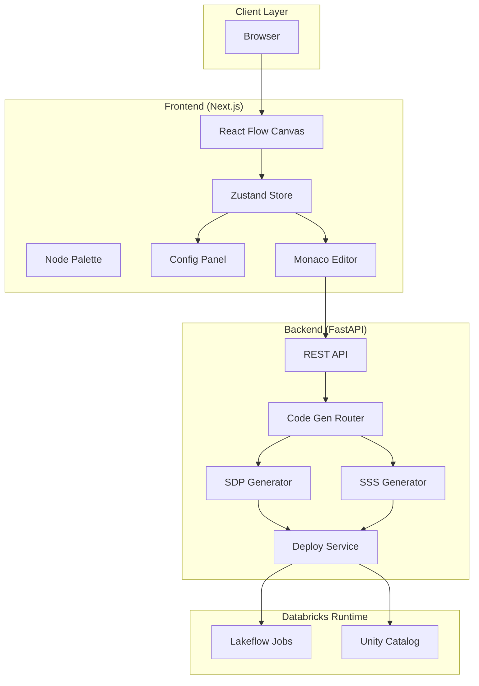
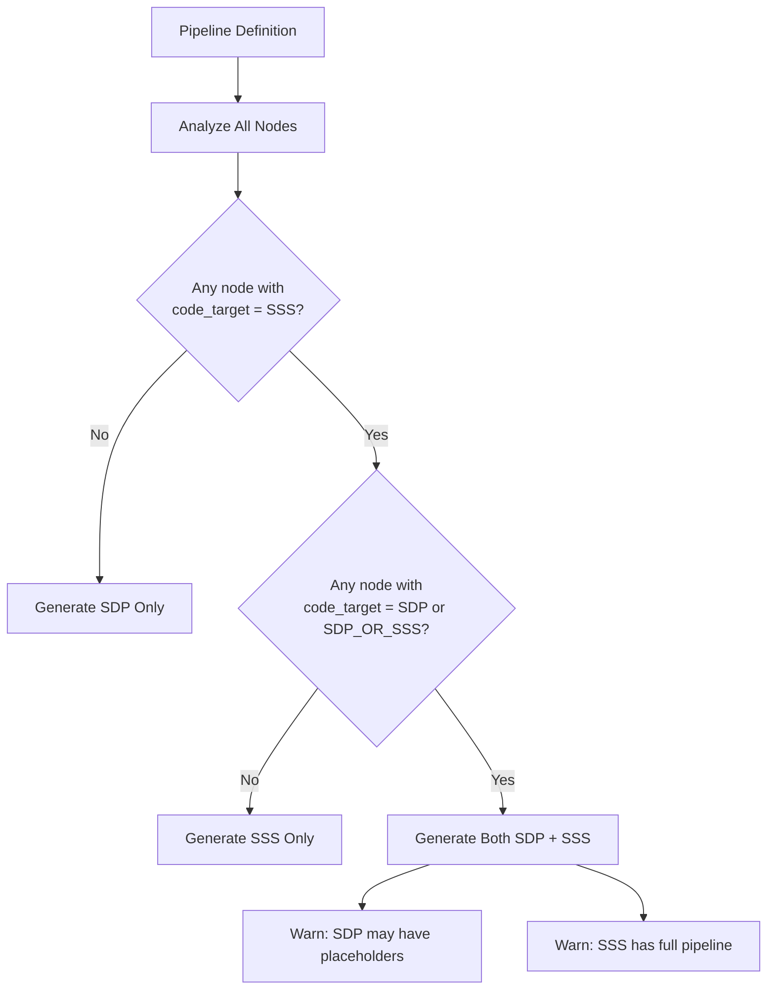

# LakeStream CEP Builder — Architecture

## System Overview

LakeStream CEP Builder is a full-stack application that converts visual pipeline graphs into executable Databricks code. The architecture follows a clear separation between the React frontend (design surface), FastAPI backend (orchestration and code generation), and Databricks runtime (execution).



---

## Code Generation Strategy

The code generation router analyzes the pipeline graph and selects the appropriate target(s) based on node capabilities.

### SDP vs SSS vs Hybrid Decision Tree



| Code Target | Node Types | Output |
|-------------|------------|--------|
| `sdp` | MATCH_RECOGNIZE SQL | SDP only |
| `sss` | Custom Python Source, Custom StatefulProcessor, Custom Python UDF | SSS only |
| `sdp-or-sss` | All other 35 nodes | Both SDP and SSS |

**Decision logic:**
- If any node has `code_target = sss` → include SSS generator
- If any node has `code_target = sdp` or `sdp-or-sss` → include SDP generator
- Hybrid pipelines produce both; SDP output may contain placeholders for SSS-only nodes

---

## State Management

### Streaming State (Runtime)

| Layer | Technology | Purpose |
|-------|------------|---------|
| Spark Structured Streaming | RocksDB + cloud checkpoints | Pattern state, watermarks, deduplication |
| Lakeflow SDP | Managed by Lakeflow | Declarative pipeline state |

Checkpoints are stored in cloud storage (S3, ADLS, GCS) configured per Lakeflow job. RocksDB backs TransformWithState for CEP patterns.

### UI State (Frontend)

| Store | Technology | Purpose |
|-------|------------|---------|
| Pipeline state | Zustand | Nodes, edges, selected node, config |
| Code preview | Zustand | Generated code, sync with canvas |

### Metadata (Backend / Databricks)

| Store | Technology | Purpose |
|-------|------------|---------|
| Pipeline definitions | Unity Catalog (optional) | Persist pipeline metadata, lineage |
| Job configs | Databricks Jobs API | Deployed Lakeflow job definitions |

---

## Node Type System Design

Each node type is defined in `NODE_REGISTRY` with:

| Field | Description |
|-------|-------------|
| `type` | Unique identifier (e.g., `sequence-detector`) |
| `label` | Display name |
| `description` | Tooltip / help text |
| `category` | source \| cep-pattern \| transform \| sink |
| `codeTarget` | sdp \| sss \| sdp-or-sss |
| `icon` | Lucide icon name |
| `color` | Hex color for canvas |
| `inputs` | Number of input handles (0–2) |
| `outputs` | Number of output handles (0–1) |
| `configFields` | Form fields for configuration |
| `advancedFields` | Optional advanced options (CEP patterns) |

**Code target semantics:**
- `sdp`: Only SDP generator supports this node
- `sss`: Only SSS generator supports this node
- `sdp-or-sss`: Both generators support this node

---

## Pattern DSL Format

The pipeline is serialized as JSON and sent to the backend. Example structure:

```json
{
  "nodes": [
    {
      "id": "n1",
      "type": "kafka-topic",
      "position": { "x": 100, "y": 100 },
      "data": {
        "config": {
          "bootstrapServers": "broker:9092",
          "topics": "events",
          "consumerGroup": "cep-consumer",
          "startingOffset": "latest",
          "deserializationFormat": "json"
        }
      }
    },
    {
      "id": "n2",
      "type": "sequence-detector",
      "position": { "x": 400, "y": 100 },
      "data": {
        "config": {
          "steps": "[{\"name\": \"A\", \"filter\": \"event_type = 'login'\"}, {\"name\": \"B\", \"filter\": \"event_type = 'purchase'\"}]",
          "contiguityMode": "relaxed",
          "withinDuration": { "value": 5, "unit": "minutes" }
        }
      }
    }
  ],
  "edges": [
    { "id": "e1", "source": "n1", "target": "n2" }
  ]
}
```

### Node Config Conventions

- **Duration fields**: `{ "value": 10, "unit": "minutes" }` — units: seconds, minutes, hours
- **Column picker**: Array of column names from upstream schema
- **Expression**: SQL-like expression string
- **Code**: JSON or Python string for custom logic

### Validation Rules

- Sources must have 0 inputs, 1 output
- Sinks must have 1 input, 0 outputs
- Transforms/patterns: 1–2 inputs, 1 output
- Graph must be acyclic and connected from sources to sinks